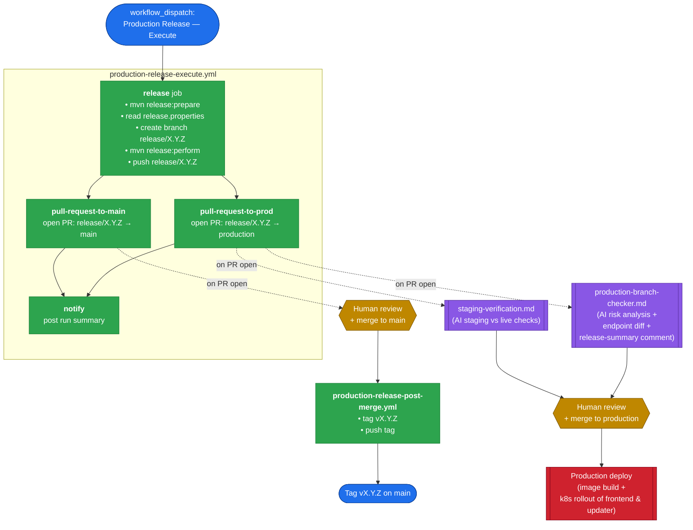

# Production Release Process

This document describes the production release workflow for the Adoptium API
and the GitHub Actions workflows that orchestrate it. The
[staging checker](../adoptium-api-v3-staging-checker/README.md) is a key part
of this process and acts as a release gate.

## Release flow overview

## Workflows

### Production Release Execute (`.github/workflows/production-release-execute.yml`)

The orchestrating release workflow, triggered manually via `workflow_dispatch`.
It:

1. Runs `mvn release:prepare`, letting Maven derive the release and next
   development versions from the current POM.
2. Reads the chosen versions back out of `release.properties`.
3. Creates a `release/X.Y.Z` branch, runs `mvn release:perform`, and pushes
   the branch.
4. Opens two PRs in parallel:
   - `release/X.Y.Z` → `main`
   - `release/X.Y.Z` → `production`
5. Posts a summary to the workflow run.

### Staging Verification (`.github/workflows/staging-verification.md`)

An AI-powered agentic workflow that builds and runs the staging checker as
part of the production release gate. It:

1. Builds the staging checker using the `staging-checker` and `adoptium` Maven profiles.
2. Runs the checker against staging vs live.
3. Uses AI judgement to determine whether any differences are expected
   intentional changes (e.g. new releases added to staging ahead of going
   live) or unexpected breakage.
4. Approves the release if differences are acceptable, or creates a
   release-blocker issue if not.

### Production Branch Checker (`.github/workflows/production-branch-checker.md`)

An AI-powered PR review agent for `main` → `production` pull requests. It
performs live endpoint comparison between staging and production as part of
its risk analysis, and produces the release-summary commentary on the PR,
using the same endpoint patterns defined in the staging checker.

### Production Release Post Merge (`.github/workflows/production-release-post-merge.yml`)

Triggered when a `release/X.Y.Z` PR is merged into `main`. It tags the
resulting commit `vX.Y.Z` and pushes the tag.
