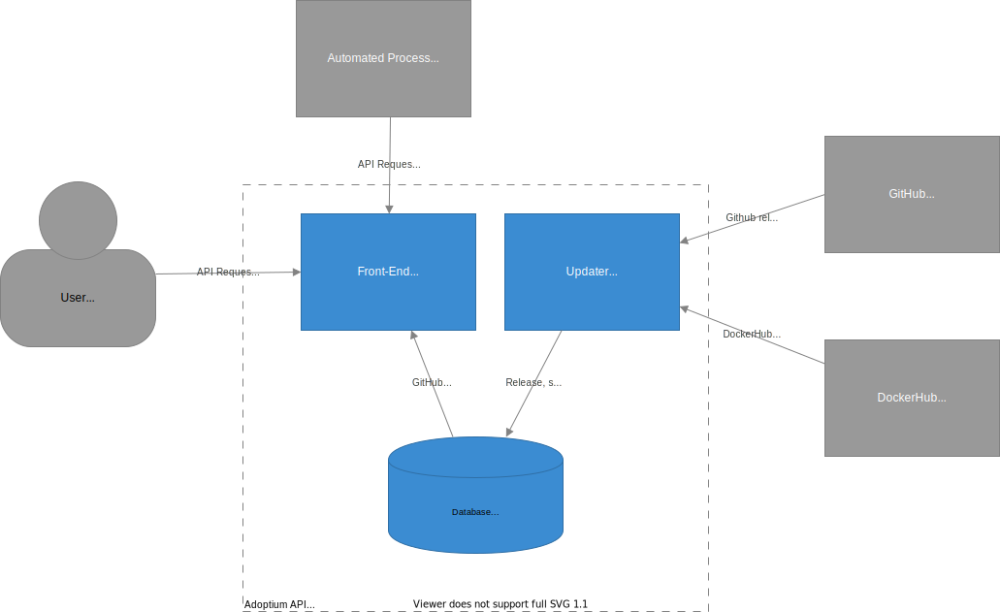

# Structure

The Adoptium API has 2 main components:

1. Updater - Pulls data from a number of sources such as Github and Docker, parses the data and stores it to the DB.
1. Front-end -  Serve up responses to web requests at <https://api.adoptium.net>.

## Architecture Diagrams

The diagrams have been created using the [C4 model](https://c4model.com/) with <http://diagrams.net/> .

### Context

### Container

## Updater

The updater periodically polls for new data, and stores that data into the DB. There are 2 types of refresh:
1. Full
    - A full refresh of all data from the various sources
    - Performed when the updater starts and then every 24 hours there-after. 
1. Incremental
    - A refresh of only newly added or modified files.
    - Performed every 6 minutes
 
The sources of data for the API are:

### GitHub
The binary repositories such as:
- https://github.com/adoptium/temurin8-binaries
- https://github.com/adoptium/temurin11-binaries
- https://github.com/adoptium/temurin17-binaries

Each of these repos contains a number of releases, inside each release are a number of assets in general for each asset there is:
- Binary archive (e.g. OpenJDK17-jdk_x64_linux_hotspot_17_35.tar.gz)
- Metadata file (e.g. OpenJDK17-jdk_x64_linux_hotspot_17_35.tar.gz.json)
- Checksum (e.g. OpenJDK17-jdk_x64_linux_hotspot_17_35.tar.gz.sha256.txt)

The attestation repositories such as:
- https://github.com/adoptium/temurin-attestations

The attestation repository contains CycloneDX Attestation xml documents that assert to the reproducible build verification of Adoptium binaries.
An attestation repository contains the following structure:
    featureVersion/releaseTag/Attestation.xml

The updater interacts with the GitHub API using the [V4 GraphQL interface](https://developer.github.com/v4/guides/intro-to-graphql/).
Once we have obtained the data through the GitHub API the Upstream (for the upstream OpenJDK project) and Adoptium mappers which map the
GitHub data into Adoptium API models.
It does this by iterating through the list of repos and releases, for each binary asset download its metadata or checksum and parse their contents in order to extract the data.
If metadata is not available then we attempt to extract the relevant data by parsing the file name.
Attestation resources are also iterated through by querying using GitHub GraphQL queries on the "Attestations github repositories".

In order to speed up access and reduce bandwidth we use Mongo as a cache for this data.
When we require data such as the metadata file or checksum, that data will be provided by the cache (assuming it is present).
An asynchronous refresh of cache will be scheduled to make sure it is up to date.

### DockerHub
The DockerHub repositories are only required for displaying stats.
We pull data from the DockerHub API inside DockerStatsInterface.

### Running
To run the updater tool:
 - generate the artifacts by running `mvnw clean install`. 
 - `cd` into the `adoptium-api-v3-updater` directory
 - run `java -jar ./target/adoptium-api-v3-updater-3.0.0-SNAPSHOT-jar-with-dependencies.jar`

### Database
The database stores 4 main types of data:
1. Release - The raw binary data extracted from GitHub
1. Stats - Download statistics. Updated at the end of a full refresh.
    - DockerStats - Broken down into each docker repository
    - GitHubStats - Broken down into each feature version
1. Web-Cache - Cached data used to speed up requests
1. Attestation - The CycloneDX reproducible build attestation

## Front-end

The front-end is a Quarkus application that uses OpenAPI for documentation.
Data is polled from the database into memory and requests are then serviced from that dataset.

### Examples

A full list of endpoints and each of the parameters can be found at <https://api.adoptium.net/swagger-ui/>

### Running
To run the front-end quarkus tool, `cd` into the `adoptium-api-v3-frontend` directory and run `../../mvnw quarkus:dev -Padoptium`. This will then run the tool on port 8080.
NOTE: You will need to have let the Updater run a full cycle before any data is shown.
